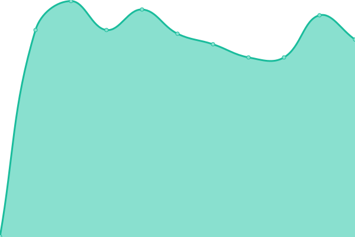

# [Status](https://status.wakatime.com): <!--live status--> **🟩 All systems operational**

This repository contains the open-source uptime monitor and status page for Wakatime, powered by [Upptime](https://upptime.js.org).

<!--start: status pages-->
<!-- This summary is generated by Upptime (https://github.com/upptime/upptime) -->
<!-- Do not edit this manually, your changes will be overwritten -->

| URL                                         | Status | History                                                                                      | Response Time                                                                  | Uptime                                                                                                                                                                                                           |
| ------------------------------------------- | ------ | -------------------------------------------------------------------------------------------- | ------------------------------------------------------------------------------ | ---------------------------------------------------------------------------------------------------------------------------------------------------------------------------------------------------------------- |
| [Website](https://wakatime.com)             | 🟩 Up  | [website.yml](https://github.com/wakatime/statuspage/commits/master/history/website.yml)     |  444ms   |      |
| [API](https://api.wakatime.com/api/v1/meta) | 🟩 Up  | [api.yml](https://github.com/wakatime/statuspage/commits/master/history/api.yml)             |  283ms       |              |
| Dashboard                                   | 🟩 Up  | [dashboard.yml](https://github.com/wakatime/statuspage/commits/master/history/dashboard.yml) |  408ms |  |

<!--end: status pages-->

[**Visit our status website →**](https://status.wakatime.com)

## 📄 License

- Code: [MIT](./LICENSE)
- Data in the `./history` directory: [Open Database License](https://opendatacommons.org/licenses/odbl/1-0/)
