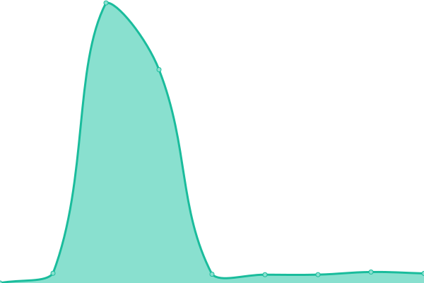

# [Status](https://status.wakatime.com): <!--live status--> **🟩 All systems operational**

This repository contains the open-source uptime monitor and status page for Wakatime, powered by [Upptime](https://upptime.js.org).

<!--start: status pages-->
<!-- This summary is generated by Upptime (https://github.com/upptime/upptime) -->
<!-- Do not edit this manually, your changes will be overwritten -->
<!-- prettier-ignore -->
| URL | Status | History | Response Time | Uptime |
| --- | ------ | ------- | ------------- | ------ |
|  [Website](https://wakatime.com) | 🟩 Up | [website.yml](https://github.com/wakatime/statuspage/commits/master/history/website.yml) | 

 472ms
     
 | 

<a href="https://status.wakatime.com/history/website">100.00%</a>
    

|  [API](https://api.wakatime.com/api/v1/meta) | 🟩 Up | [api.yml](https://github.com/wakatime/statuspage/commits/master/history/api.yml) | 

 340ms
     
 | 

<a href="https://status.wakatime.com/history/api">100.00%</a>
    

|  Dashboard | 🟩 Up | [dashboard.yml](https://github.com/wakatime/statuspage/commits/master/history/dashboard.yml) | 

 579ms
     
 | 

<a href="https://status.wakatime.com/history/dashboard">99.64%</a>
    

<!--end: status pages-->

[**Visit our status website →**](https://status.wakatime.com)

## 📄 License

- Code: [MIT](./LICENSE)
- Data in the `./history` directory: [Open Database License](https://opendatacommons.org/licenses/odbl/1-0/)
